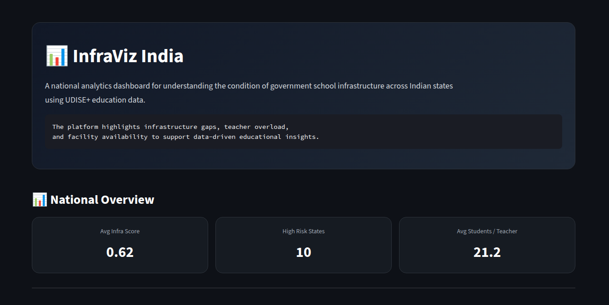
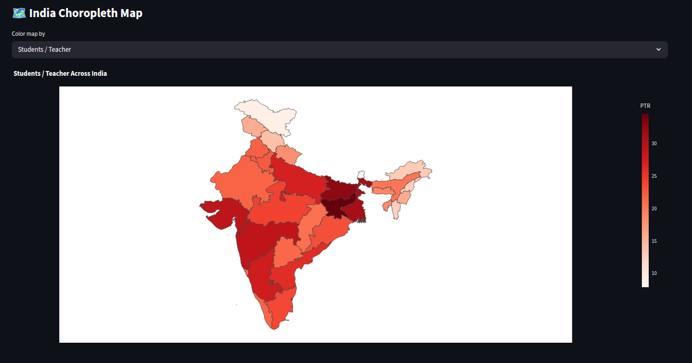
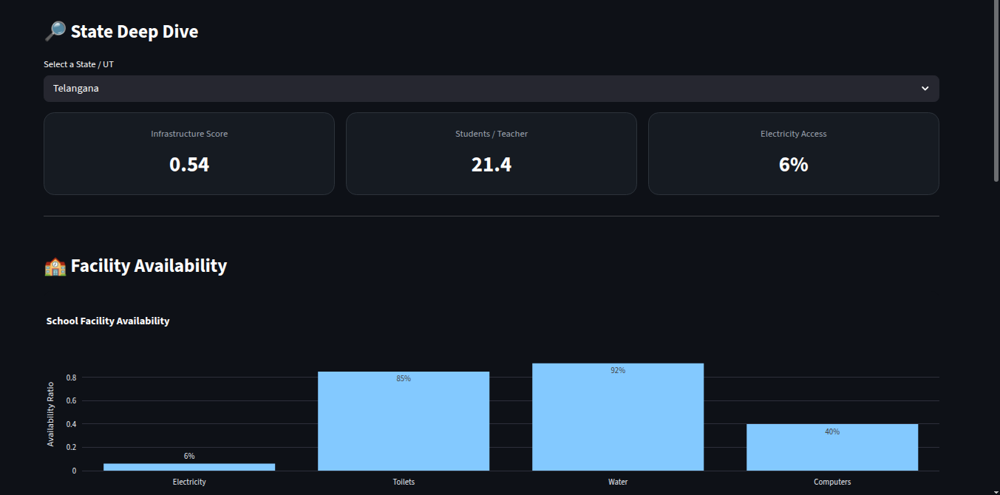
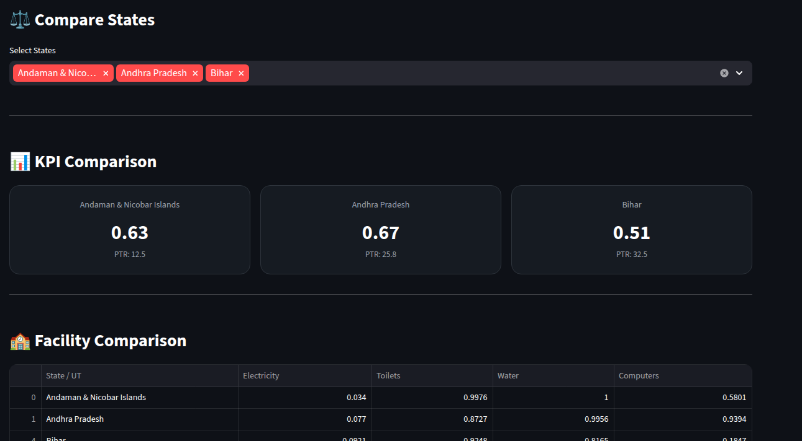

# 🏫 InfraViz India — Government School Infrastructure Intelligence Dashboard

> *Educational infrastructure gaps are not just statistics — they directly influence learning quality, accessibility, and long-term development outcomes.*

InfraViz India is an interactive analytics dashboard built using real UDISE+ government education data to analyze school infrastructure quality across Indian states and union territories.

The platform identifies:
- infrastructure-deficient regions
- teacher overload risks
- facility availability gaps
- high-priority education zones

through interactive visual analytics and state-level comparisons.

---

## 📌 Problem Statement

India operates one of the largest public education systems in the world.

However, infrastructure quality across schools remains uneven:
- some regions lack functional electricity
- some schools operate without proper sanitation
- teacher overload affects learning quality
- digital infrastructure remains inconsistent

Raw education datasets alone do not clearly reveal:
- which states are struggling most
- which facilities are critically lacking
- where intervention is urgently needed
- how infrastructure compares nationally

This project transforms raw UDISE+ education data into an interactive decision-support dashboard for infrastructure analysis.

---

## 🎯 Project Objectives

The dashboard was designed to:

- Analyze school infrastructure quality across India
- Identify high-risk states with infrastructure and teacher issues
- Measure facility availability ratios
- Compare states across key education metrics
- Provide interactive state-level deep-dive analysis
- Support data-driven educational insights

---

## 🚀 Key Features

### 🗺️ National Infrastructure Map
Interactive India choropleth map showing:
- Good infrastructure states
- Average infrastructure states
- Poor infrastructure states

---

### 🚨 Risk Detection System
Automatically identifies:
- infrastructure risk states
- teacher overload regions
- critical intervention zones

based on threshold-driven logic.

---

### 🔎 State Deep Dive
Detailed analysis for each state:
- infrastructure score
- student-teacher ratio
- facility availability
- infrastructure diagnosis
- suggested actions

---

### ⚖️ State Comparison Engine
Compare multiple states using:
- radar charts
- grouped comparisons
- facility metrics
- infrastructure indicators

---

### 📊 Facility Analytics
Tracks availability of:
- Electricity
- Toilets
- Drinking Water
- Computer Facilities

across Indian schools.

---

## 📂 Dataset

| Property | Detail |
|---|---|
| Dataset | UDISE+ 2023–24 |
| Coverage | Indian States & Union Territories |
| Source | Ministry of Education, Government of India |
| Type | Educational Infrastructure Data |

---

## 🧹 Data Cleaning & Processing

### Cleaning Steps
- Removed invalid rows
- Standardized state names
- Renamed columns for readability
- Fixed inconsistent formatting
- Converted metrics into numerical format

---

### Engineered Metrics

| Metric | Description |
|---|---|
| `infra_score` | Composite infrastructure quality score |
| `PTR` | Student-to-Teacher Ratio |
| `electricity_ratio` | Functional electricity availability |
| `water_ratio` | Drinking water availability |
| `computer_ratio` | Computer facility availability |
| `toilet_ratio` | Functional toilet availability |

---

## 🧠 Infrastructure Scoring Methodology

The dashboard uses normalized facility availability ratios to estimate infrastructure quality.

### Infrastructure Score Factors
- Electricity Access
- Toilet Availability
- Drinking Water Access
- Computer Facilities

Scores are categorized into:
- 🟢 Good
- 🟡 Average
- 🔴 Poor

based on percentile thresholds.

---

## 🚨 Risk Classification Logic

States are marked as high-risk when:
- infrastructure quality falls below threshold levels
- student-teacher ratio becomes critically high

This helps identify states requiring urgent educational attention.

---

## 📊 Dashboard Sections

| Section | Purpose |
|---|---|
| National Overview | Summary KPIs and facility distribution |
| India Map | State-wise infrastructure quality |
| Risk States | Critical infrastructure & PTR analysis |
| State Deep Dive | Detailed state diagnosis |
| Compare States | Multi-state analytical comparison |

---

## 📈 Key Insights

### ⚡ Infrastructure inequality is highly uneven
Several states show strong basic infrastructure coverage, while others lag significantly in sanitation, electricity, and digital facilities.

---

### 👨‍🏫 Teacher overload remains a major issue
Certain regions show dangerously high student-teacher ratios, indicating pressure on learning quality.

---

### 💻 Digital infrastructure gaps are still visible
Computer access remains inconsistent across states despite improvements in basic facilities.

---

### 🚰 Basic facilities strongly influence overall infrastructure quality
States with weak water and electricity access consistently perform poorly in overall infrastructure scoring.

---

## 🛠️ Tech Stack

| Tool | Purpose |
|---|---|
| Python | Core development |
| Pandas | Data cleaning & analysis |
| Streamlit | Interactive dashboard |
| Plotly | Interactive visualizations |
| GeoJSON | India infrastructure mapping |

---

## 📸 Dashboard Preview

### 📊 National Overview



---

### 🗺️ Infrastructure Map



---

### 🔎 State Deep Dive



---

### ⚖️ Compare States



---

## 📁 Project Structure

```bash
EduGap-India/
│
├── app.py
│
├── assets/
│   ├── styles.css
│   └── india_states.geojson
│
├── data/
│   ├── raw/
│   └── processed/
│
├── notebooks/
│
├── utils/
│   ├── config.py
│   ├── helpers.py
│   ├── data_loader.py
│   └── plots.py
│
├── pages/
│   ├── overview.py
│   ├── india_map.py
│   ├── risk_states.py
│   ├── state_deepdive.py
│   └── compare_states.py
│
└── README.md
```

---

## ▶️ Run Locally

```bash
git clone https://github.com/prasadk1628/EduGap-India.git

cd EduGap-India

pip install -r requirements.txt

streamlit run app.py
```

---

## 🔮 Future Improvements

- Historical trend analysis
- District-level analysis
- Predictive infrastructure scoring
- Time-series education tracking
- Policy recommendation engine
- Real-time education analytics integration

---

## 📄 License

Licensed under the MIT License.

---

## 👤 Author

**Vara Prasad K**  
Aspiring Data Analyst | Python • SQL • Streamlit

- GitHub: https://github.com/prasadk1628
- LinkedIn: https://www.linkedin.com/in/vara-prasad-k-4a6026230/
